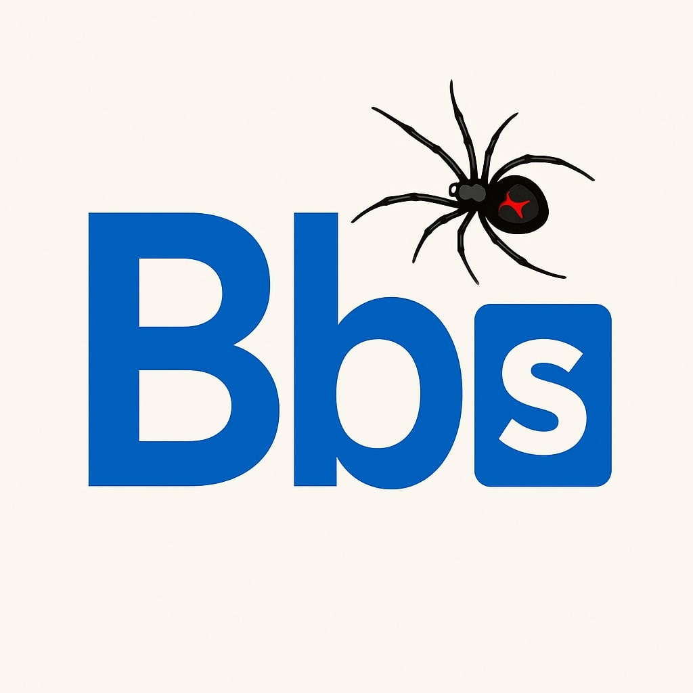
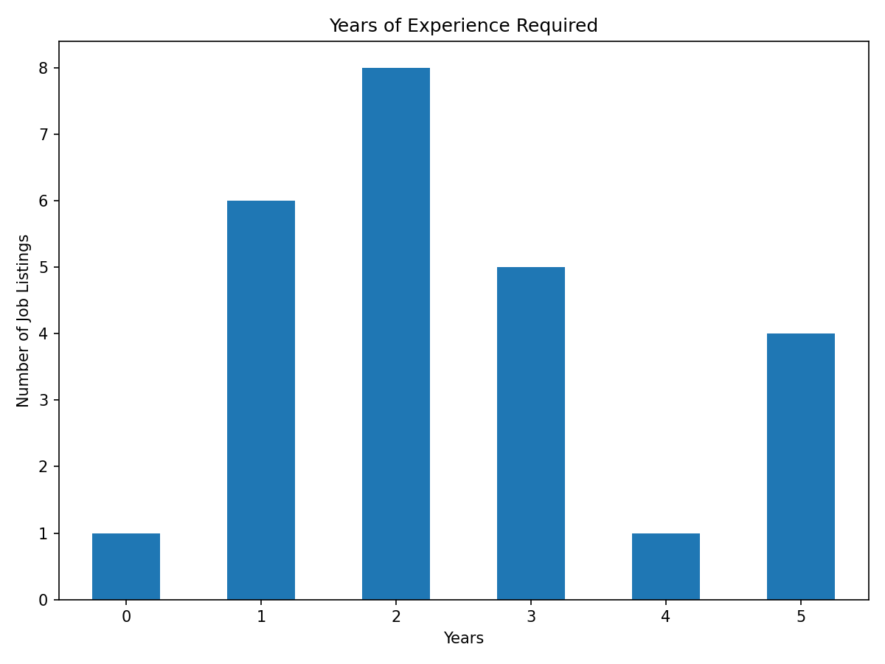
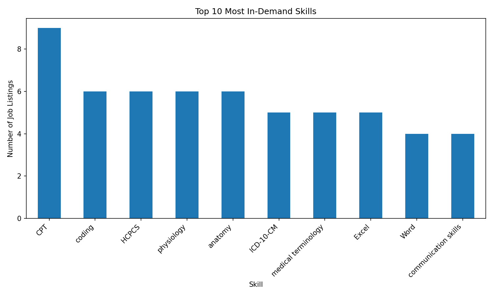
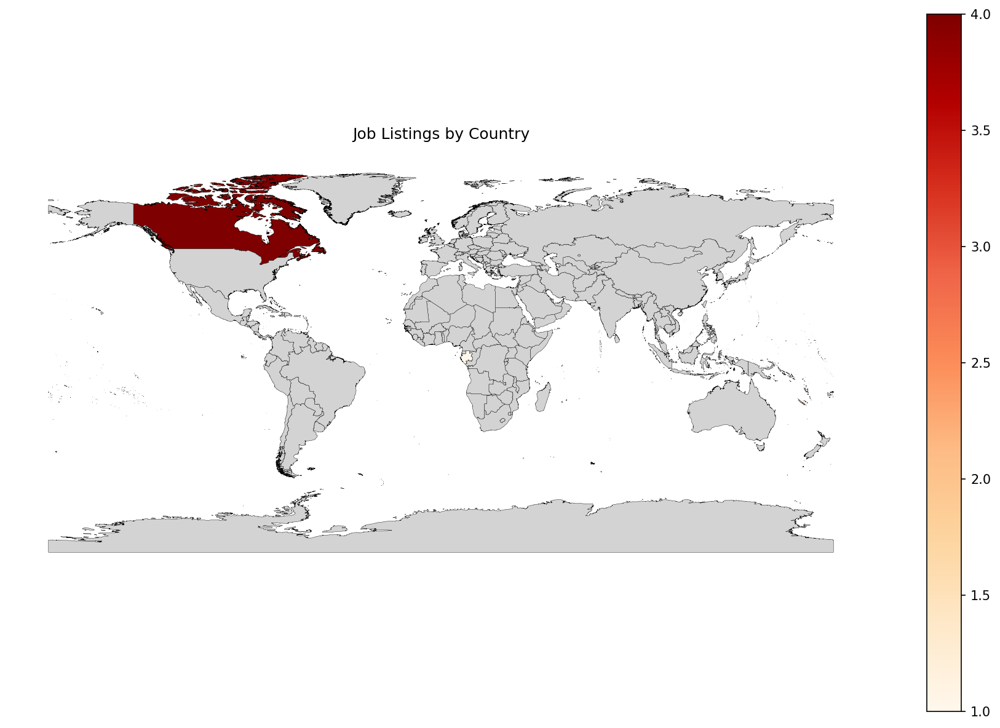

# BBS scraping

> **B**ig **B**lue & **S**tupid company scraping project.

## 🤓 What this does

- Crawls LinkedIn’s “see more jobs” guest endpoint with **Scrapy**.
- Visits each job page to extract the description, then uses your `analyze.requirements.extract()` to pull:
  - `required_skills`
  - `years_experience`
- Saves one CSV **per run** and generates three PNG charts right next to it:
  - `top_skills.png` — Top N skills
  - `experience_levels.png` — Histogram of years required
  - `location_heatmap.png` — Choropleth by country

## 🧰 Requirements

- **Python 3.13** (required)
- `pip` and a virtual environment
- Windows/macOS/Linux supported. No GUI needed — Matplotlib uses the headless **Agg** backend.

## ⚙️ Install

```bash
# 1) clone
git clone https://github.com/uzlss/bbs_scraping.git
cd bbs_scraping

# 2) create & activate virtualenv
python -m venv .venv
# Windows
.venv\Scripts\activate
# macOS/Linux
# source .venv/bin/activate

# 3) install requirements
pip install -r requirements.txt

# 4) copy sample configs (optional)
# environment
cp .env.sample .env
# proxies for scraping
cp proxy.json.sample proxy.json
```

## 🚀 Run a crawl

Basic:

```bash
scrapy crawl jobs -a role="Python Developer"
```

Filter by location (optional):

```bash
scrapy crawl jobs -a role="Python Developer" -a location="Vilnius, Lithuania"
```

## 📦 Output layout & examples

All artifacts for a single run live in the same dated folder:

```
data/<role_slug>/<YYYY-MM-DD>/
├─ jobs.csv
├─ top_skills.png
├─ experience_levels.png
└─ location_heatmap.png
```

Example (for role `python developer` on 2025‑08‑08):

```
data/python_developer/2025-08-08/
```



### What to expect
- **jobs.csv**: one row per job with `title, company_name, location, listed_date, detail_link, skills, years_of_experience`.
- **top_skills.png**: bar chart of the most common skills.
- **experience_levels.png**: bar chart of required years of experience.
- **location_heatmap.png**: world map shaded by job counts per country.
> The analyzer tolerates `skills` as Python list strings (e.g., `"['Python','Django']"`) *or* as plain comma‑separated strings.

## 🧠 How it works (quick)
- The spider exports to `data/<role_slug>/<YYYY-MM-DD>/jobs.csv`.
- After feed export completes, analytics runs automatically and drops the PNGs into the same folder.
- Country resolution is data‑driven (no hard‑coded country lists) and works for locations like `"Vilnius, Vilniaus, Lithuania"` or just `"Lithuania"`.

## 🪪 License (MIT)
This project is licensed under the **MIT License** — free to use, copy, modify, and distribute, with attribution and **no warranty**.